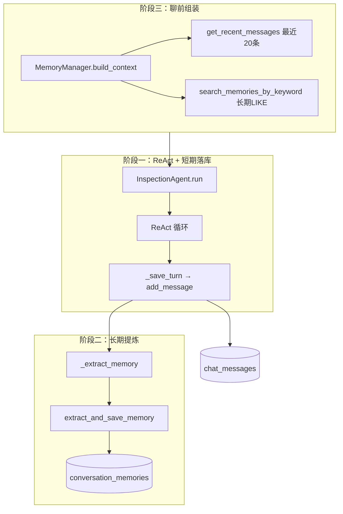
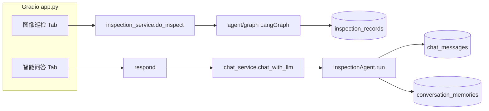
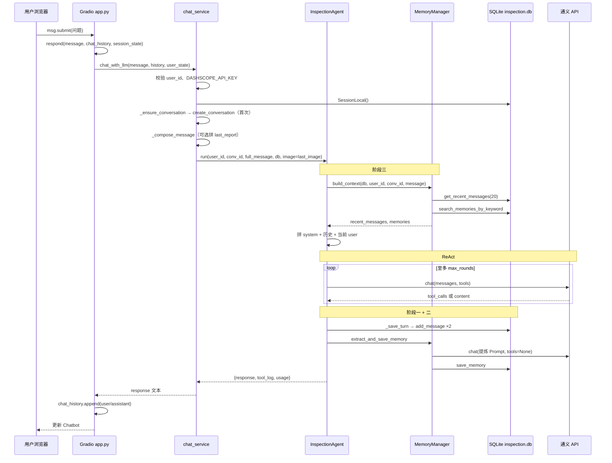

# 建筑巡检 Agent — 历史记忆（双层记忆）实现与使用说明

> 文档版本：2026-05-28（v2：已接入 Gradio 智能问答）  
> 适用范围：`InspectionAgent` + `MemoryManager` + ReAct；**Gradio「智能问答」Tab 已接入**；「图像巡检」Tab 仍走 LangGraph

---

## 目录

1. [背景与目标](#1-背景与目标)  
2. [总体架构](#2-总体架构)  
3. [三阶段实现说明](#3-三阶段实现说明)  
4. [全部代码改动清单与修改原因](#4-全部代码改动清单与修改原因)  
5. [主项目如何调用记忆功能（底层逻辑）](#5-主项目如何调用记忆功能底层逻辑)  
6. [已知问题](#6-已知问题)  
7. [如何使用与手动检验](#7-如何使用与手动检验)  
8. [数据表结构速查](#8-数据表结构速查)  
9. [实现状态总表](#9-实现状态总表)  
10. [变更记录](#10-变更记录)

---

## 1. 背景与目标

本项目为建筑外立面巡检场景设计**双层记忆**：

| 层级 | 数据表 | 作用 |
|------|--------|------|
| **短期记忆** | `chat_messages` | 当前会话内对话流水，多轮语境、代词消解 |
| **长期记忆** | `conversation_memories` | 跨会话的用户偏好、客观事实（`conversation_id` 常为 NULL） |

单次用户问答在 ReAct 路径上的目标链路：

```
聊前组装 build_context → ReAct 推理 → 短期落库 _save_turn → 长期提炼 _extract_memory → 返回回复
```

---

## 2. 总体架构

### 2.1 记忆子系统（核心）



### 2.2 主项目两条 AI 路径（重要）



| 入口 | 是否使用双层记忆 |
|------|------------------|
| Gradio「**智能问答**」 | ✅ 是（本文 v2 接入） |
| Gradio「图像巡检」 | ❌ 否（LangGraph，写巡检业务表） |
| `scripts/test_memory.py` | ✅ 是（集成测试） |
| FastAPI `api/main.py` 上传巡检 | ❌ 否（LangGraph） |

---

## 3. 三阶段实现说明

### 3.1 阶段一：短期记忆落库

**状态：✅ 已实现**

| 项目 | 说明 |
|------|------|
| 触发时机 | ReAct 循环结束后 |
| 实现位置 | `InspectionAgent._save_turn`（**未改动 ReAct 循环本体**） |
| 落库 | `add_message` → `chat_messages` |

- `user`：用户本轮原文（Gradio 侧可能含拼接后的巡检报告前缀，见 [5.3](#53-消息如何拼进-agent)）。
- `assistant`：AI 最终回复；若有工具调用，`metadata.tool_calls` 存工具日志（结果可能已截断）。
- ReAct 中间 `role=tool` **不单独入库**。

### 3.2 阶段二：长期记忆提炼

**状态：✅ 已实现（同步，非后台线程）**

| 项目 | 说明 |
|------|------|
| 触发 | `_save_turn` 之后，同一次 `run()` 内 |
| 调用链 | `_extract_memory` → `MemoryManager.extract_and_save_memory` |
| API | `LLMClient.chat(..., tools=None)` + `MEMORY_EXTRACTION_SYSTEM_PROMPT` |
| 窗口 | 最近 20 条 `chat_messages` |
| 存储 | JSON 解析 → `save_memory`，`conversation_id=None`（用户级全局） |

### 3.3 阶段三：聊前上下文组装

**状态：✅ 已实现（`run()` 内自动）**

| 项目 | 说明 |
|------|------|
| 短期 | `get_recent_messages(conversation_id, limit=20)` |
| 长期 | `search_memories_by_keyword(user_id, keyword=整句用户问题)` |
| 注入 | 长期 → system 末尾；短期 → system 与当前 user 之间 |
| 自动触发 | `recent_messages` 或 `memories` 为 **`None`** 时，`run()` 开头调用 `build_context` |

---

## 4. 全部代码改动清单与修改原因

### 4.1 `agent/orchestrator.py`（记忆编排收口）

| 改动 | 修改原因 |
|------|----------|
| `from agent.memory_manager import MemoryManager` | 编排层需要读写记忆 |
| `self.memory_manager = MemoryManager()` | 与 Agent 同生命周期，避免重复实例化 |
| `run()` 开头：`recent_messages`/`memories` 为 `None` 时 `build_context` | **阶段三产品化**：调用方不必手写拉取逻辑 |
| `run()` 末尾：`_save_turn` 后 `_extract_memory` | **阶段二产品化**：每轮问答结束自动提炼，测试脚本不必重复调用 |
| 新增 `_extract_memory` | 封装「读 20 条 → extract_and_save_memory」 |
| **未修改** ReAct `for` 循环、`_save_turn` 函数体 | 满足「不动 ReAct / _save_turn」约束，降低回归风险 |

### 4.2 `agent/memory_manager.py`（记忆模块，既有实现）

| 能力 | 说明 |
|------|------|
| `build_context` | 短期 20 条 + 长期 LIKE 检索 |
| `extract_and_save_memory` | 第二次 LLM 调用，解析 NONE/JSON，`save_memory` |
| `_parse_memory_payload` | 容错 Markdown 代码块、嵌入 JSON |

本文件为记忆**领域逻辑**集中处；主项目与测试均依赖此模块，无需重复实现。

### 4.3 `services/chat_service.py`（v2：Gradio 智能问答接入）

**修改前：** 使用本地 **Ollama** HTTP API，上下文仅来自 Gradio 内存中的 `chat_history` + `user_state["last_report"]`，**不写数据库**。

**修改后：** 使用 **`InspectionAgent.run()`**，完整走双层记忆。

| 函数/逻辑 | 作用 | 修改原因 |
|-----------|------|----------|
| `_get_agent()` | 懒加载单例 `InspectionAgent` + `build_tools()` | 避免每次提问加载 CV 模型；与 API 层懒加载模式一致 |
| `_ensure_conversation()` | 无 `conversation_id` 时 `create_conversation` | 短期记忆必须挂在 `conversations.id` 上 |
| `_compose_message()` | 若有 `last_report` 拼进用户消息 | 保留原「基于最新巡检报告问答」体验，不依赖单独 RAG |
| `chat_with_llm()` | 调 `agent.run(user_id, conversation_id, message, db, image=...)` | **主项目入口对接记忆链路的唯一桥接函数** |
| `reset_chat_session()` | `conversation_id = None` | 「清空对话」= 新会话，短期记忆重新开始；长期仍按 `user_id` 检索 |

**移除：** Ollama `requests.post` 路径（智能问答不再依赖 `OLLAMA_BASE_URL`）。

### 4.4 `services/inspection_service.py`

| 改动 | 修改原因 |
|------|----------|
| `next_state` 增加 `"last_image": image` | 用户在「图像巡检」后于「智能问答」提问时，可把同一张图传给 `agent.run(image=...)`，供 CV 工具使用 |

**未改：** `do_inspect` / LangGraph 巡检主流程。

### 4.5 `app.py`

| 改动 | 修改原因 |
|------|----------|
| 智能问答 Tab 文案 | 说明已启用 ReAct + 双层记忆 |
| `clear.click` → `_clear_chat` + `reset_chat_session` | 清空 UI 同时重置 DB 会话 id，避免短期记忆与界面不一致 |
| 导入 `reset_chat_session` | 供清空按钮使用 |

**未改：** `respond()` 仍调用 `chat_with_llm`（函数名保留，避免改动面过大）。

### 4.6 `services/constants.py`

| 改动 | 修改原因 |
|------|----------|
| 新增 `llm_no_api_key` | 未配置 `DASHSCOPE_API_KEY` 时给用户明确提示 |

### 4.7 `services/__init__.py`

| 改动 | 修改原因 |
|------|----------|
| 导出 `reset_chat_session` | 供 `app.py` 清空对话使用 |

### 4.8 `scripts/test_memory.py`

| 改动 | 修改原因 |
|------|----------|
| 去掉手写 `extract_and_save_memory` | 与 `run()` 内自动提炼重复 |
| 仍可保留 `build_context` 打印 | 便于观察检索条数（调试） |

### 4.9 未改动的文件

| 文件 | 说明 |
|------|------|
| `db/chat_crud.py`、`db/memory_crud.py`、`db/models.py` | 表与 CRUD 已满足需求 |
| `agent/graph.py`、`api/main.py` | 图像巡检 API 仍 LangGraph |
| `llm/client.py`、`llm/tools.py` | 被 Agent 复用，无记忆专用改动 |

---

## 5. 主项目如何调用记忆功能（底层逻辑）

本节描述用户在前端点击「智能问答」发送一条消息后，**从 UI 到数据库**的完整调用链。

### 5.1 调用链总览（时序）



### 5.2 会话状态 `session_state` 里有什么

登录成功（`auth_service.handle_login`）后：

```python
user_state = {
    "user_id": user.id,
    "username": user.username,
    "role": "...",
    # 以下由业务流程写入
    "conversation_id": None,      # 首次问答时由 chat_service 创建
    "last_report": "...",       # 图像巡检成功后写入
    "last_image": ndarray,      # 同上，供 run(image=...)
    "last_material": "...",
    ...
}
```

| 字段 | 谁写入 | 记忆中的作用 |
|------|--------|----------------|
| `user_id` | 登录 | 长期记忆检索、`save_memory` |
| `conversation_id` | `chat_service._ensure_conversation` | 短期记忆 `chat_messages.conversation_id` |
| `last_report` | `inspect_and_save` | 拼进本轮 `message`，非 DB 记忆 |
| `last_image` | `inspect_and_save` | 可选传给 ReAct CV 工具 |

点击「**清空对话**」：`conversation_id → None`，下次提问会 `create_conversation` 新会话。

### 5.3 消息如何拼进 Agent

`chat_service._compose_message`：

```text
【最近一次巡检报告（供回答参考）】
{last_report 全文}

【用户问题】
{用户在输入框打的字}
```

该**整段字符串**作为 `agent.run(message=...)` 的 `message` 参数：

- 进入 `build_context` 的 `keyword` 也是整段（影响长期 LIKE 命中率）。
- `_save_turn` 存入 `chat_messages` 的 user 行也是整段（库内可见拼接痕迹）。

若用户未做图像巡检，则只传输入框原文。

### 5.4 `InspectionAgent.run()` 内部（与测试脚本相同）

Gradio 与 `test_memory.py` 在记忆逻辑上**完全一致**，均依赖 `run()` 内置步骤：

1. **`build_context`**（参数为 `None` 时）  
2. 组装 `messages` 列表  
3. **ReAct** `self.llm.chat(..., tools=tool_schemas)`  
4. **`_save_turn`**  
5. **`_extract_memory`**  

Gradio **不再**使用 `chat_history` 参数做 LLM 上下文——历史由 DB `chat_messages` 经 `build_context` 注入。  
`chat_history` 仅用于界面展示（`respond` 里 append）。

### 5.5 数据库写到哪里

默认库：`.env` 中 `INSPECTION_DB_URL`（常见 `sqlite:///./inspection.db`）。

| 操作 | 表 |
|------|-----|
| 每轮问答结束 | `chat_messages` +2 |
| 提炼成功 | `conversation_memories` +1 或 upsert |
| 首次智能问答 | `conversations` +1（title=智能问答） |

**注意：** `test_memory.py` 使用 `memory_test.db`，与主程序默认库可能不同；DBeaver 需连对文件。

### 5.6 与「图像巡检」Tab 的关系

- **巡检 Tab**：`inspect_and_save` → LangGraph → `inspection_records`，**不**写 `chat_messages`。  
- **问答 Tab**：读 `last_report` / `last_image` 作为**本轮输入增强**，记忆仍由 `InspectionAgent` 管理。  
- 两 Tab **不自动合并**为同一条 `conversation_id`；巡检对话历史不在「智能问答」会话里，除非用户在同一问答会话中继续聊。

---

## 6. 已知问题

### 6.1 长期记忆「库里有、build_context 显示 0」

`search_memories_by_keyword` 用**整句**用户问题做 `LIKE`。问「外墙脱落报告」时，难以匹配已存「100字、严厉」类偏好。  
**写入成功 ≠ 检索命中。**

### 6.2 长期检索能力

当前为阶段 0.5 的 SQLite `LIKE`；向量检索见 `memory_crud.py` 注释（ChromaDB 待做）。

### 6.3 提炼失败无日志

`extract_and_save_memory` 中 `except Exception: return` 静默。

### 6.4 首次问答耗时

懒加载 `build_tools()` 与 CV 模型，首条消息可能较慢。

### 6.5 图像巡检路径仍无记忆

仅「智能问答」接入；API 上传图片巡检未改。

---

## 7. 如何使用与手动检验

### 7.1 环境

- `.env`：`DASHSCOPE_API_KEY`、`INSPECTION_DB_URL`（可选）
- `pip install -r requirements.txt`
- 智能问答若触发 CV 工具： `models/` 权重齐全

### 7.2 启动主项目

```powershell
cd "C:\Users\hp\Desktop\新\building-agent-1"
.\.venv\Scripts\Activate.ps1
python app.py
```

流程：登录 →（建议）图像巡检一次 → 打开「智能问答」多轮对话 → DBeaver 查看 `inspection.db` 的 `chat_messages`、`conversation_memories`。

### 7.3 运行测试脚本（可选）

```powershell
$env:PYTHONPATH = (Get-Location).Path
python scripts\test_memory.py
```

使用 `memory_test.db`，与主程序库文件可能不同。

### 7.4 检验清单

| 检查项 | 预期 |
|--------|------|
| 登录后智能问答 | 不报错（有 API Key） |
| 每发一条消息 | `chat_messages` +2 |
| 声明报告偏好后 | `conversation_memories` 有 `preference` |
| 长期记忆 `conversation_id` | `NULL` |
| 清空对话后再问 | 新 `conversation_id`，短期从 0 条开始累加 |
| 图像巡检 Tab | 仍正常，不写 `chat_messages` |

### 7.5 程序化调用（与 Gradio 等价）

```python
from db import SessionLocal
from db.chat_crud import create_conversation
from llm.client import LLMClient
from llm.tools import build_tools
from agent.orchestrator import InspectionAgent

db = SessionLocal()
conv = create_conversation(db, user_id=1, title="智能问答")
agent = InspectionAgent(LLMClient())
agent.tools = build_tools()

result = agent.run(
    user_id=1,
    conversation_id=conv.id,
    message="用户问题",
    db=db,
)
db.close()
```

---

## 8. 数据表结构速查

### `chat_messages`（短期）

| 字段 | 说明 |
|------|------|
| `conversation_id` | 会话 ID（Gradio 智能问答一条会话） |
| `role` | `user` / `assistant` |
| `content` | 正文 |
| `metadata` | 如 `tool_calls` |

### `conversation_memories`（长期）

| 字段 | 说明 |
|------|------|
| `user_id` | 检索主键（跨会话） |
| `conversation_id` | 常为 `NULL` |
| `memory_type` | `preference` / `user_fact` / `building_info` / `summary` |
| `key` | upsert 去重 |
| `content` | 记忆正文 |

---

## 9. 实现状态总表

| 能力 | 状态 | 备注 |
|------|------|------|
| 短期落库 `_save_turn` | ✅ | |
| 长期提炼 `extract_and_save_memory` | ✅ | `run()` 内同步 |
| 聊前组装 `build_context` | ✅ | `None` 时自动 |
| Gradio 智能问答接入 | ✅ | v2 `chat_service.py` |
| Gradio 图像巡检接入 | ❌ | LangGraph |
| FastAPI 巡检接入 | ❌ | LangGraph |
| 长期智能召回 | ⚠️ | 整句 LIKE |
| 异步后台提炼 | ❌ | |
| 独立总结模型 | ❌ | 共用 `LLMClient` |

---

## 10. 变更记录

| 日期 | 版本 | 内容 |
|------|------|------|
| 2026-05-28 | v1 | `memory_manager.py`、`orchestrator` 挂接提炼与自动 `build_context`；`scripts/test_memory.py` |
| 2026-05-28 | v2 | **Gradio 智能问答**接入：`chat_service.py` 重写、`inspection_service` 增加 `last_image`、`app.py` 清空会话；本文档更新主项目调用链 |

---

## 附录：关键代码索引

| 场景 | 文件 | 函数/类 |
|------|------|---------|
| 前端入口 | `app.py` | `respond` → `chat_with_llm` |
| 桥接层 | `services/chat_service.py` | `chat_with_llm`, `_ensure_conversation`, `_get_agent` |
| 记忆编排 | `agent/orchestrator.py` | `InspectionAgent.run`, `_save_turn`, `_extract_memory` |
| 记忆领域 | `agent/memory_manager.py` | `MemoryManager` |
| 短期 CRUD | `db/chat_crud.py` | `add_message`, `get_recent_messages` |
| 长期 CRUD | `db/memory_crud.py` | `save_memory`, `search_memories_by_keyword` |
| LLM | `llm/client.py` | `LLMClient.chat` |

---

*文档结束。*
