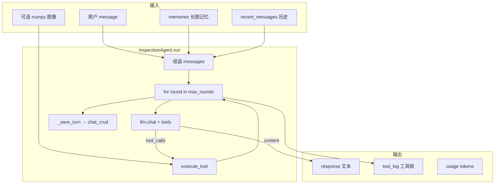

# ReAct Agent 自底向上测试复盘报告


步骤一：环境与依赖排查（基础设施层）
含义：检查工作所需的“干粮”和“工具箱”是否备齐。检查 .env（API 密钥）和 models/（权重文件）。

作用：排除“低级死穴”。深度学习项目最怕跑了 5 分钟后告诉你 FileNotFoundError 或者 CUDA Out of Memory。确认这些物理文件和密钥存在，是为了确保后面的测试不会因为最基础的配置问题而阻断。

步骤二：LLM 握手与 Tool Schema 验证（大脑认知层）
含义：测试 Agent 的“大脑（通义千问）”能否听懂人类设定的规则，以及能否正确理解“工具说明书（JSON Schema）”。

作用：验证 Function Calling 机制。在这一步，我们不真正执行任何本地 CV 模型。我们只发一句文字，看大模型返回的 JSON 里有没有 tool_calls。

如果失败：说明大模型能力不足，或者我们的 Schema（比如工具描述 description）写得太模糊，导致大模型不知道该用哪个工具。

步骤三：CV 工具单点执行测试（四肢执行层）
含义：脱离大模型，单独测试充当“手眼”的本地计算机视觉模型（YOLO、EfficientNet）。

作用：验证工具的物理可用性。大模型决定调用工具后，如果本地的 Python 代码报错了，大模型也无能为力。这一步通过传入一个“假图片矩阵（Numpy Array）”，来验证模型加载逻辑（_ensure_loaded）、PyTorch 显存分配、以及图像预处理逻辑是否正常运行。

步骤四：ReAct 主控循环端到端测试（中枢神经层）
含义：将“大脑（LLM）”、“四肢（Tools）”和“记忆（DB）”组装在一起，测试 InspectionAgent 的核心 while 循环。

作用：验证思维链（Chain of Thought）和状态机流转。这是唯一能测试以下动态场景的一步：

LLM 请求调用 classify_material 工具。

代码拦截请求，执行 YOLO 代码。

代码将 YOLO 的结果组装成 role: tool 消息，发回给 LLM。

LLM 基于这个新信息，决定是继续调用 detect_defects，还是直接输出最终报告。

测试 max_rounds（最大轮次保护）是否生效，防止 LLM 陷入无限调用的死循环。


> 本文档记录「阶段 1 ReAct Agent」从环境排查到准生产级多轮对话的完整测试过程、原理说明与结论。  
> **不包含业务源码修改说明**；所有验证均在 `scripts/` 独立脚本中完成。  
> 生成日期：2026-05-28

---

## 目录

1. [测试范围与架构总览](#1-测试范围与架构总览)
2. [阶段一：环境依赖排查](#2-阶段一环境依赖排查)
3. [阶段二：LLM 客户端与 Tool Schema 握手](#3-阶段二llm-客户端与-tool-schema-握手)
4. [阶段三：视觉工具（CV Tool）封装](#4-阶段三视觉工具cv-tool封装)
5. [阶段四：ReAct 主控循环与多轮对话](#5-阶段四react-主控循环与多轮对话)
6. [测试脚本清单](#6-测试脚本清单)
7. [关键发现与风险清单](#7-关键发现与风险清单)
8. [与 Gradio / LangGraph 巡检的关系](#8-与-gradio--langgraph-巡检的关系)
9. [最终结论](#9-最终结论)

---

## 1. 测试范围与架构总览

### 1.1 被测对象

| 模块 | 路径 | 职责 |
|------|------|------|
| LLM 客户端 | `llm/client.py` | 通义千问 OpenAI 兼容 API、Function Calling |
| Tool 封装 | `llm/tools.py` | 5 个 Tool Schema + CV/知识库执行 |
| ReAct 编排器 | `agent/orchestrator.py` | `InspectionAgent.run()` 思维链循环 |
| 对话持久化 | `db/chat_crud.py` | `Conversation` / `ChatMessage` CRUD |
| 长期记忆模型 | `db/models.py` | `ConversationMemory` 等 ORM |

### 1.2 数据流（端到端）



### 1.3 五条 Tool 与模型文件对应关系

| Tool 名称 | 类型 | 权重文件 | Predictor |
|-----------|------|----------|-----------|
| `classify_material` | CV | `material.pth` | `MaterialPredictor` (EfficientNetV2-L) |
| `estimate_floors` | CV | `main_building.pt` + `outer_obj.pt` | `FloorPredictor` (双 YOLO) |
| `detect_extension` | CV | `add_predict.pth` | `AddedFloorPredictor` |
| `detect_defects` | CV | `best.pt` | `HiddenDangerPredictor` (YOLO OBB) |
| `search_knowledge` | 检索 | — | `search_memories_by_keyword`（SQLite 过渡） |

---

## 2. 阶段一：环境依赖排查

### 2.1 检查项与结果

| 检查项 | 结果 | 说明 |
|--------|------|------|
| 根目录 `.env` | 存在 | 须 **保存到磁盘** 后进程才能读取 |
| `DASHSCOPE_API_KEY` | 已配置 | `llm/client.py` 模块加载时 `os.getenv` |
| `LLM_MODEL` | 已配置 | 如 `qwen3.6-flash-2026-04-16`；需在控制台确认模型 ID 有效 |
| `models/*.pt` / `*.pth` | 5/5 齐全 | 含 `best.pt`、`material.pth` |

### 2.2 缺失时的典型报错

| 缺失项 | 影响阶段 | 典型现象 |
|--------|----------|----------|
| **无 `DASHSCOPE_API_KEY`** | LLM / ReAct | `HTTPError 401 Unauthorized`；`import` 不报错，首次 `chat()` 失败 |
| **无模型文件** | CV Tool / Gradio 启动 | `FileNotFoundError: models/xxx.pt`；或 Tool 返回 `推理失败: ...` |
| **占位 `best.pt`**（yolov8n） | `detect_defects` | 可加载但推理报 `'NoneType' object is not iterable`；非 OBB 专用权重 |

### 2.3 环境变量加载注意

- 独立测试脚本应在 **`import db` / `LLMClient` 之前** `load_dotenv(.env)`。
- 内存库测试须 **覆盖** `.env` 中的 `INSPECTION_DB_URL`：

  ```text
  sqlite:///:memory:
  ```

  避免污染项目 `inspection.db`。

---

## 3. 阶段二：LLM 客户端与 Tool Schema 握手

### 3.1 `LLMClient.chat()` 做了什么

- 请求：`POST {LLM_BASE_URL}/chat/completions`
- 请求体：`model`、`messages`、`tools`（Schema 列表）、`tool_choice: "auto"`
- 返回统一结构：

  ```json
  {
    "content": "文本或 null/空",
    "tool_calls": [{ "id", "function": { "name", "arguments" } }],
    "finish_reason": "tool_calls | stop",
    "usage": { "prompt_tokens", "completion_tokens", "total_tokens" },
    "model": "..."
  }
  ```

### 3.2 大模型如何自主决定调用哪个工具？

**机制：Function Calling（OpenAI 兼容），不是硬编码 if-else。**

1. 请求里附带每个 Tool 的 **JSON Schema**（`name`、`description`、`parameters`）。
2. 模型阅读 **用户意图 + System Prompt + 工具说明书**，在内部推理后输出：
   - 要么 `tool_calls`（要调用的函数名 + 参数 JSON 字符串）；
   - 要么 `content`（直接文本回答）。
3. **`description` 是决定选型的重要依据**。例如：
   - 「查建筑规范」→ 倾向 `search_knowledge`
   - 「楼顶私自搭棚」→ 倾向 `detect_extension`
   - 「水渍裂缝」→ 倾向 `detect_defects`
   - 「写一首诗」→ 与巡检 Tool 无关 → 通常 **不调工具**，`finish_reason: stop`

编排器 **不** 替模型选工具；只负责把 Schema 传给 API，并执行返回的 `function.name`。

### 3.3 基础握手测试（`test_agent_step1_llm.py`）

- 用户句：「外墙面砖脱落了，帮我查一下相关的建筑规范」
- **实测**：`finish_reason: tool_calls`，`function.name: search_knowledge`，`arguments: {"query": "..."}`。
- **`content` 为空**：正常。本轮任务是「发起工具调用」，不是写最终报告。

### 3.4 进阶意图测试（`test_agent_step2_llm_advanced.py`）

| 用例 | 意图 | 实测工具选择 | 并行？ |
|------|------|--------------|--------|
| A | 楼层 + 材质 + 规范 | `estimate_floors`, `classify_material` | 是（同轮 2 个） |
| B | 违建 + 水渍裂缝 | `detect_extension`, `detect_defects` | 是 |
| C | 两种规范检索 | `search_knowledge` ×2（不同 query） | 是 |
| D | 写诗（无关） | 无；`finish_reason: stop`，直接写诗 | — |

**要点**：

- 支持 **Parallel Tool Calling**：一次响应中 `tool_calls` 数组可含多项。
- 一次请求 **不一定** 覆盖用户全部子意图（如 A 未同轮调用 `search_knowledge`，可能留到下一轮 ReAct）。
- 边界用例 D 验证模型 **不会乱调** 巡检工具。

### 3.5 Function Calling 串联原理（简图）

```text
用户消息
  → chat(tools=schemas)
  → 若 tool_calls:
       追加 assistant(tool_calls)
       对每个 call: execute_tool → 追加 role=tool 消息
       再次 chat(tools=schemas)  ← 模型此时「看到」工具返回文本
  → 若仅 content:
       作为最终回复，结束本轮 run
```

---

## 4. 阶段三：视觉工具（CV Tool）封装

### 4.1 `CVToolWrapper` 与延迟加载

```text
build_tools()  →  仅创建 Wrapper + lambda 工厂，_predictor = None
execute(image) →  _ensure_loaded() → 首次 new Predictor → YOLO/torch.load
再次 execute   →  复用同一 _predictor
```

**为何不在 Agent 构建时加载全部模型？**

| 原因 | 说明 |
|------|------|
| 启动速度 | 5 份权重大，全量加载可达数 GB、数十秒 |
| 按需使用 | ReAct 可能只调 1～2 个 Tool |
| 与 LLM 测试解耦 | 仅测 Schema 握手时无需加载 CV |
| 失败隔离 | 某权重损坏仅影响被调用的 Tool |

### 4.2 `test_agent_step2_tool.py` 实测

- 工具：`detect_defects`
- 输入：`np.zeros((640,640,3))`
- 执行前 `_predictor is None` → 执行后已加载
- 返回：`推理失败: 'NoneType' object is not iterable`（占位 `best.pt` 场景）
- **封装层正常**：异常被捕获为字符串，不导致进程崩溃，ReAct 可将失败信息交给 LLM。

### 4.3 `search_knowledge` 说明

- 当前实现：`search_memories_by_keyword`（SQLite LIKE），非 ChromaDB。
- 空库时返回：「未找到与'xxx'相关的知识。」

---

## 5. 阶段四：ReAct 主控循环与多轮对话

### 5.1 `InspectionAgent.run()` 核心循环

```python
for round_idx in range(self.max_rounds):   # 默认 10
    resp = self.llm.chat(messages, tools=self.tool_schemas)
    if resp["tool_calls"]:
        messages += assistant(tool_calls)
        for each tc:
            result = execute_tool(..., image=image, **fn_args)
            messages += tool(tool_call_id, content=result[:2000])
            tool_log.append(...)
    else:
        final_text = resp["content"]
        break
else:
    # 跑满 max_rounds：追加「请生成巡检报告」再 chat 一次
```

| 概念 | 含义 |
|------|------|
| **外层一轮** | 一次 `llm.chat` 请求 |
| **内层多个 tool_calls** | 同一次响应中的并行工具决定，**串行执行** |
| **`tool_log`** | 每次 `execute_tool` 一条记录（name, args, result, elapsed_ms） |
| **`rounds` 字段** | 实为 `len(tool_log)`，非外层 LLM 次数 |

### 5.2 思维链机制（ReAct 在本项目中的体现）

本项目 **未单独存储** Chain-of-Thought 文本；「思维链」体现在：

1. **LLM 内部推理**（对用户不可见）；
2. **`tool_log` + 多轮 messages**（可观测痕迹）；
3. **最终 `response`**（结合工具结果的文本）。

典型一轮 `run` 内链式过程：

```text
用户：全面巡检
  → LLM: tool_calls [classify_material, detect_defects, ...]
  → 执行工具，结果写入 messages
  → LLM: 可能继续 tool_calls [search_knowledge]
  → 执行检索
  → LLM: content = 结构化报告，break
  → _save_turn 写入 DB
```

### 5.3 `max_rounds` 的作用与风险

| 无上限风险 | 有 `max_rounds=10` |
|------------|-------------------|
| 模型反复 tool_calls 死循环 | 最多 10 次外层 LLM 请求 |
| Token 费用暴涨 | 超限后强制总结一轮 |
| 上下文撑爆 | 单条 tool 结果截断 2000 字 |

### 5.4 端到端测试（`test_agent_step3_react.py`）

- 内存库 + 假图 + 用户：「这栋楼有什么隐患吗？材质是什么？帮我出个报告」
- **实测**：6 次工具调用；报告结构化并标注来源；`detect_defects` 失败时模型 **不编造隐患清单**，写明检测异常。

### 5.5 准生产级多轮测试（`test_agent_step4_advanced.py`）

#### 长期记忆注入

两条 `ConversationMemory`（可不落库），经 `memories=` 传入：

| 记忆 | memory_type | 内容要点 |
|------|-------------|----------|
| 1 | `preference` | 报告极简短、语气极严厉 |
| 2 | `building_info` | 上月刚做防水外墙涂料翻新 |

编排器将其拼入第二条 `system` 消息：`## 历史相关记忆\n- [...]`。

#### 第一轮

- 用户：看材质和层数，结合偏好。
- **实测**：`classify_material`、`estimate_floors`；回复严厉且引用翻新记忆。

#### 第二轮

- `get_recent_messages` 加载 2 条（user + assistant）。
- 用户：隐患 + 知识库检索规范。
- **实测**：多次 `detect_defects` 失败（占位权重）；`prompt_tokens` 显著高于第一轮。

#### `_history_to_messages` 与 Token 控制

```python
# agent/orchestrator.py
role = r.role if r.role != "tool" else "user"
if len(content) > 2000:
    content = content[:2000] + "..."
```

| 机制 | 作用 |
|------|------|
| `get_recent_messages(..., limit=20)` | 只带最近 20 条 DB 消息 |
| 单条 2000 字截断 | 防止单条 assistant 报告撑爆上下文 |
| `tool` → `user` 折叠 | 简化历史中的 tool 角色 |

**注意**：`_save_turn` 只存 user 原文 + assistant 最终回复；**不**把上轮 `tool_log` 逐步注入历史。第二轮依赖 **文字摘要 + 重新执行工具**。

#### 「先 detect_defects，再 search_knowledge」如何实现？

**不是** 把检测结果作为 `search_knowledge` 的函数参数（该 Tool 只有 `query` 字符串）。

**而是** ReAct 消息链：

```text
assistant(tool_calls: detect_defects)
  → tool: "检测到: 裂缝 ..." 或 "推理失败: ..."
  → 再次 chat
  → assistant(tool_calls: search_knowledge, arguments: {"query": "裂缝 危险等级..."})
  → tool: 检索结果
  → assistant(content: 最终报告)
```

理想情况下在同一 `run()` 的多轮外层循环中完成；**本次占位权重运行可能未出现 `search_knowledge`**，模型改用通用规范文本收尾。

---

## 6. 测试脚本清单

| 脚本 | 阶段 | 用途 |
|------|------|------|
| `scripts/test_agent_step1_llm.py` | 二 | 基础 Function Calling 握手 |
| `scripts/test_agent_step2_llm_advanced.py` | 二 | 四用例复杂意图 + 并行调用 |
| `scripts/test_agent_step2_tool.py` | 三 | `detect_defects` + 延迟加载验证 |
| `scripts/test_agent_step3_react.py` | 四 | `InspectionAgent.run` 端到端 |
| `scripts/test_agent_step4_advanced.py` | 四 | 长期记忆 + 两轮对话 + 历史上下文 |

**通用运行方式**（项目根目录）：

```powershell
.\.venv\Scripts\Activate.ps1
python scripts/<脚本名>.py
```

---

## 7. 关键发现与风险清单

| # | 发现 | 建议 |
|---|------|------|
| 1 | 模型根据 Schema **description** 自主选型，支持并行 `tool_calls` | 优化 Tool 描述即可影响行为，无需改选型代码 |
| 2 | 有 `tool_calls` 时 `content` 常为空 | 属正常；最终报告在后续轮次 |
| 3 | 占位 `best.pt` 导致 `detect_defects` 不可靠 | 生产须换正式 OBB 权重 |
| 4 | `search_knowledge` 当前为 SQLite 关键词检索 | 空库时恒为「未找到」；阶段 1.4 计划 ChromaDB |
| 5 | `rounds` 返回值 = 工具次数，非 LLM 轮数 | 读日志时注意区分 |
| 6 | `.env` 须保存到磁盘；测试脚本需 `load_dotenv` | IDE 未保存会导致 401 |
| 7 | ReAct **未接入** `app.py` / `api/chat.py` | 当前 Gradio 巡检仍走 `agent/graph.py` LangGraph |
| 8 | 同一 `run` 内 CV 工具共享 `image` 参数 | 由 `execute_tool(..., image=image)` 注入，非 LLM 参数 |

---

## 8. 与 Gradio / LangGraph 巡检的关系

| 维度 | ReAct Agent (`orchestrator.py`) | 当前 Gradio/API 巡检 (`graph.py`) |
|------|--------------------------------|-----------------------------------|
| 决策 | LLM 自主选 Tool | 固定 DAG：材质→楼层→加层→隐患→报告 |
| LLM | 通义 `DASHSCOPE_API_KEY` | 报告节点常用 Ollama |
| 接入状态 | 测试脚本验证通过 | 生产 UI 默认路径 |
| 模型加载 | Tool 延迟加载 | `nodes.py` import 时加载 |

**结论**：ReAct 链路 **已跑通**，但与现网 Gradio 巡检是 **并行两套架构**；上线 ReAct 需单独接 API（如规划中的 `api/chat.py`）。

---

## 9. 最终结论

### 9.1 测试结论

| 层次 | 状态 |
|------|------|
| 环境（Key + 权重文件） | 通过（正式 `best.pt` 建议替换占位） |
| LLM ↔ Tool Schema 握手 | 通过 |
| 复杂意图 / 并行调用 / 边界用例 | 通过 |
| CV Tool 封装与延迟加载 | 通过 |
| `InspectionAgent.run` 端到端 | 通过 |
| 长期记忆 + 多轮 `recent_messages` | 通过 |

### 9.2 一句话总结

**ReAct Agent 核心链路已验证可用**：通义千问能通过 Function Calling 自主选择与并行调用建筑巡检工具，编排器通过 `messages` 串联工具结果并生成报告，支持长期记忆与多轮对话；当前主要瓶颈在 **正式 CV 权重**、**知识库数据** 以及 **与 Gradio 生产入口的集成**，而非 ReAct 循环本身的设计。

### 9.3 建议的后续工作（非本次测试范围）

1. 替换 `models/best.pt` 为团队 OBB 隐患模型，复跑 step2_tool / step3 / step4。  
2. 向 `conversation_memories` 或 ChromaDB 灌入规范知识，验证 `search_knowledge` 串行链。  
3. 实现并对接 `api/chat.py`，将 `InspectionAgent` 暴露为 HTTP 服务。  
4. 明确 Gradio 是否切换至 ReAct，或保持 LangGraph 双轨并行。

---

*文档结束 — 仅作测试复盘，不代表生产部署承诺。*
